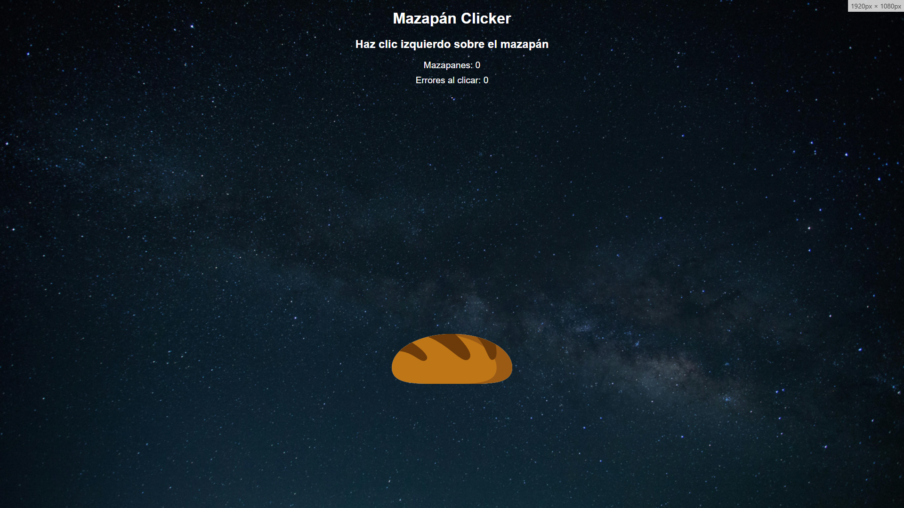

# Mazapán Clicker 🥖🏃‍♂️

**Una vuelta de tuerca al género cookie clicker**  

Mazapán Clicker lleva los *clickers* a un nuevo nivel: precisión, estrategia y paciencia serán tus mejores aliados. Ideal para fans de desafíos extremos y jugadores de estilo *no-hit*. ¿Te atreves?

## 🎮 Cómo Jugar

1. Accede al juego aquí: [Mazapán Clicker](https://alvarofergar.github.io/mazapanclicker/).  
2. Haz clic en el mazapán.  

## 🖥️ Requisitos  

Este juego está **diseñado exclusivamente para PC** debido a los altísimos requisitos gráficos necesarios para procesar la compleja interacción con el mazapán en tiempo real.

Tendrás que ignorar que el mazapán es un realidad un pan. Hay mazapanes con forma de barra de pan, ¿vale?

## 🧩 Pista  

Para desbloquear el final secreto tal vez debas observar con sigilo el mundo fuera de los límites habituales.

## 📜 Sobre el Proyecto  

Un proyecto rápido para refrescar habilidades en desarrollo web usando **HTML**, **CSS** y **JavaScript**. Mazapán Clicker combina frustración y malas físicas en una experiencia única.
